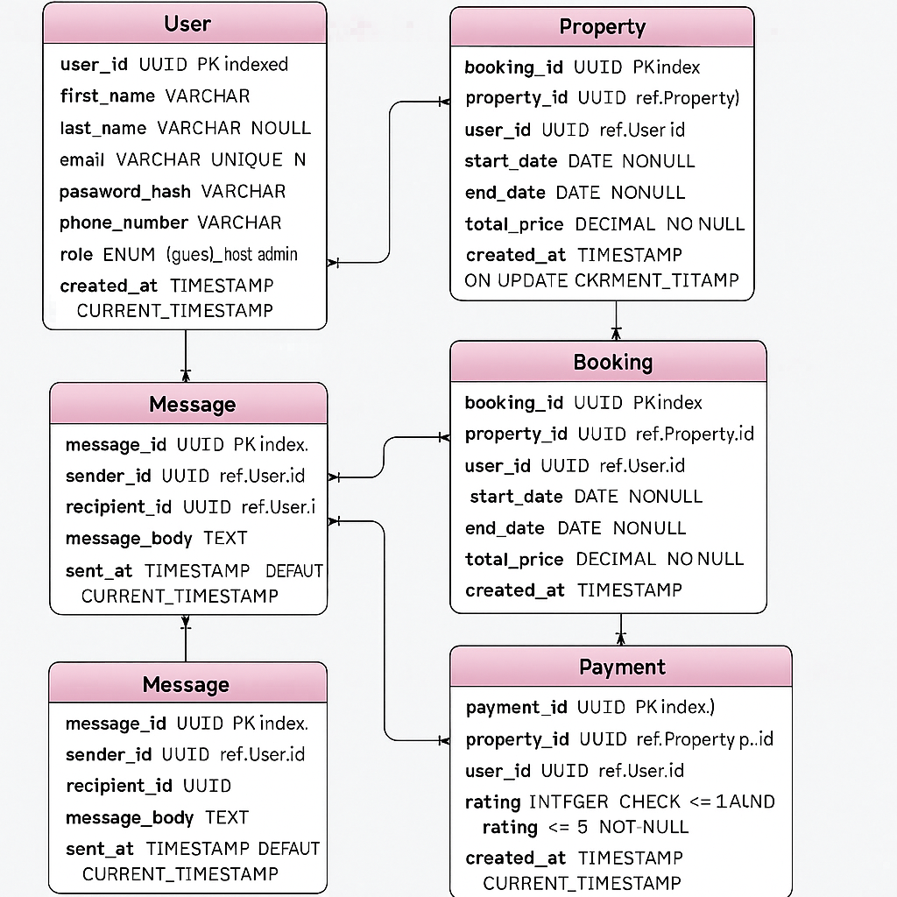

# ER Diagram Requirements

## Objective
Define the entities, attributes, and relationships necessary to model the core database for the Airbnb-like application. This document outlines the schema in compliance with the provided specification.

---

## Entities and Attributes

### 1. User
- `user_id`: UUID, Primary Key, Indexed
- `first_name`: VARCHAR, NOT NULL
- `last_name`: VARCHAR, NOT NULL
- `email`: VARCHAR, UNIQUE, NOT NULL
- `password_hash`: VARCHAR, NOT NULL
- `phone_number`: VARCHAR, NULL
- `role`: ENUM('guest', 'host', 'admin'), NOT NULL
- `created_at`: TIMESTAMP, DEFAULT CURRENT_TIMESTAMP

### 2. Property
- `property_id`: UUID, Primary Key, Indexed
- `host_id`: UUID, Foreign Key → User(user_id)
- `name`: VARCHAR, NOT NULL
- `description`: TEXT, NOT NULL
- `location`: VARCHAR, NOT NULL
- `pricepernight`: DECIMAL, NOT NULL
- `created_at`: TIMESTAMP, DEFAULT CURRENT_TIMESTAMP
- `updated_at`: TIMESTAMP, ON UPDATE CURRENT_TIMESTAMP

### 3. Booking
- `booking_id`: UUID, Primary Key, Indexed
- `property_id`: UUID, Foreign Key → Property(property_id)
- `user_id`: UUID, Foreign Key → User(user_id)
- `start_date`: DATE, NOT NULL
- `end_date`: DATE, NOT NULL
- `total_price`: DECIMAL, NOT NULL
- `status`: ENUM('pending', 'confirmed', 'canceled'), NOT NULL
- `created_at`: TIMESTAMP, DEFAULT CURRENT_TIMESTAMP

### 4. Payment
- `payment_id`: UUID, Primary Key, Indexed
- `booking_id`: UUID, Foreign Key → Booking(booking_id)
- `amount`: DECIMAL, NOT NULL
- `payment_date`: TIMESTAMP, DEFAULT CURRENT_TIMESTAMP
- `payment_method`: ENUM('credit_card', 'paypal', 'stripe'), NOT NULL

### 5. Review
- `review_id`: UUID, Primary Key, Indexed
- `property_id`: UUID, Foreign Key → Property(property_id)
- `user_id`: UUID, Foreign Key → User(user_id)
- `rating`: INTEGER, CHECK rating BETWEEN 1 AND 5, NOT NULL
- `comment`: TEXT, NOT NULL
- `created_at`: TIMESTAMP, DEFAULT CURRENT_TIMESTAMP

### 6. Message
- `message_id`: UUID, Primary Key, Indexed
- `sender_id`: UUID, Foreign Key → User(user_id)
- `recipient_id`: UUID, Foreign Key → User(user_id)
- `message_body`: TEXT, NOT NULL
- `sent_at`: TIMESTAMP, DEFAULT CURRENT_TIMESTAMP

---

## Relationships

- **User — Property**: One-to-Many (host)
- **User — Booking**: One-to-Many (guest booking)
- **User — Review**: One-to-Many (user posts many reviews)
- **User — Message**: Self-referencing One-to-Many (sender/recipient)
- **Property — Booking**: One-to-Many
- **Property — Review**: One-to-Many
- **Booking — Payment**: One-to-One

---

## Constraints Summary

- **User**: Unique on `email`; `role` must be one of the ENUM values.
- **Property**: Foreign key on `host_id` to User.
- **Booking**: Foreign keys on `property_id` and `user_id`; `status` must be ENUM.
- **Payment**: Foreign key on `booking_id`.
- **Review**: Rating must be 1–5.
- **Message**: Foreign keys on both `sender_id` and `recipient_id`.

---

## Indexing Notes

- Primary keys are indexed automatically.
- Additional indexes required on:
  - `User.email`
  - `Property.property_id`
  - `Booking.booking_id`

---

## Next Step

- Create a visual ER diagram using **Draw.io**, **Lucidchart**, or another diagramming tool.
- Export the diagram as `.png` or `.svg`.
- Place it under: `ERD/diagram.png` (or similar format).

